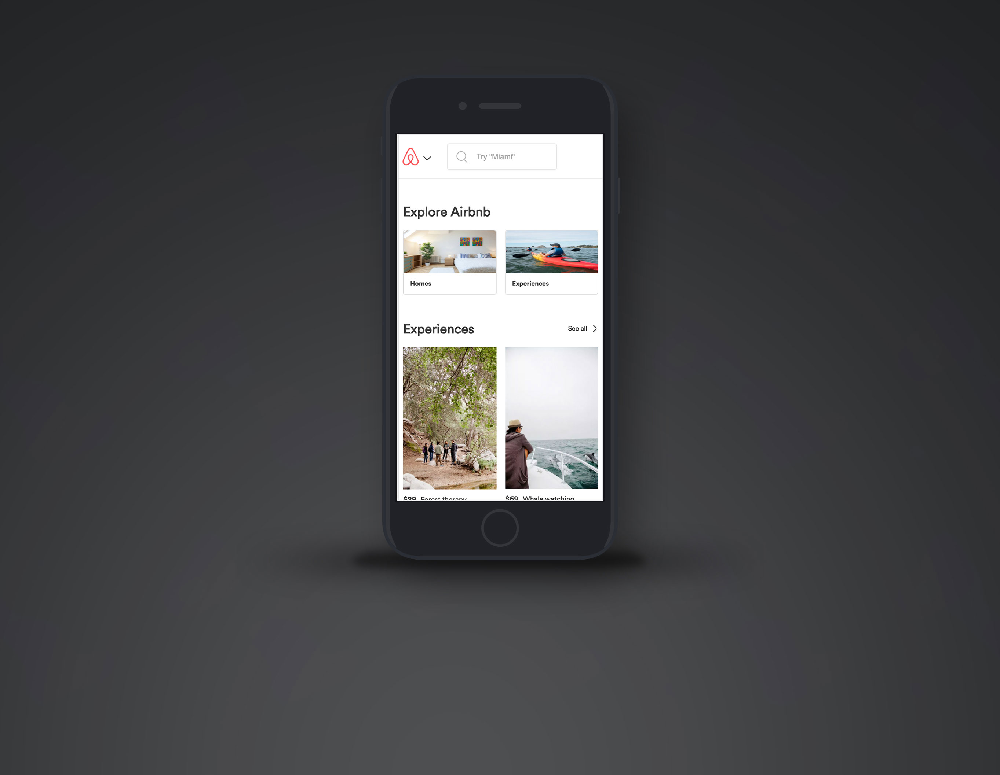

# Airbnb demo frontend
My homework project at [Evgeny Rodionov's](https://github.com/evgenyrodionov) [frontend course](https://erodionov.ru/).

[Demo](https://build-qmxkwhbueq.now.sh/)

Visual implementation is guided by layouts from the course materials that are based on official [Airbnb](https://Airbnb.com). 
Airbnb® is a registered trademark of AIRBNB, INC.

# Screenshots





# How to run
```bash
git clone git@github.com:dskiba/airbnb-demo-frontend.git
cd airbnb-demo-frontend
yarn install # or npm install
yarn start # or npm start
```
